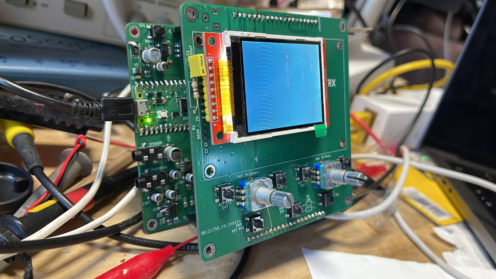
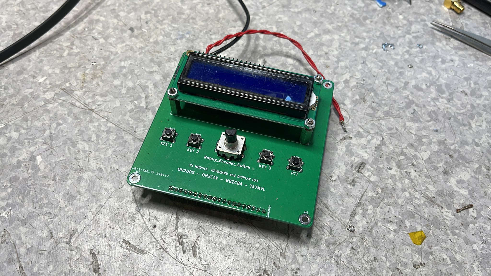
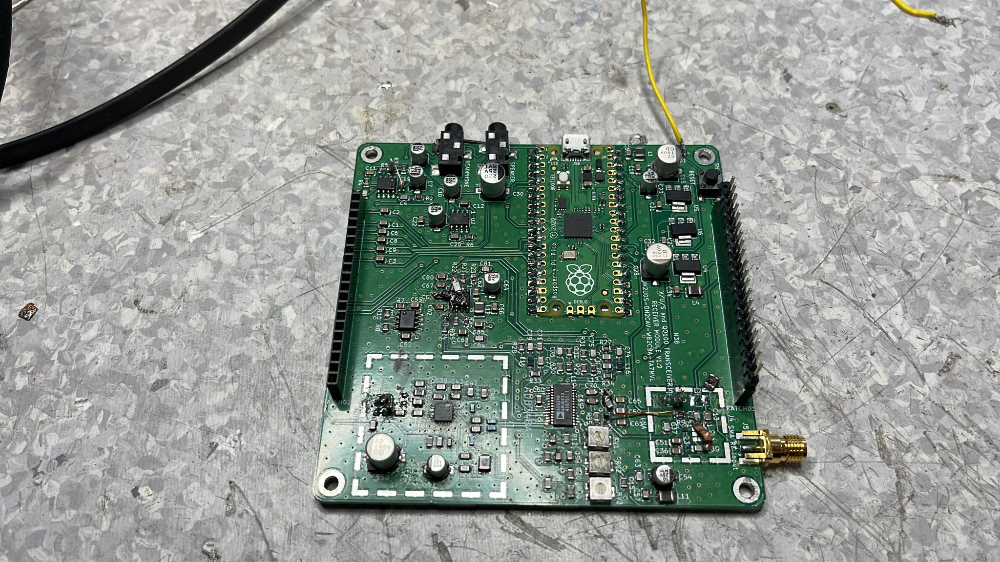
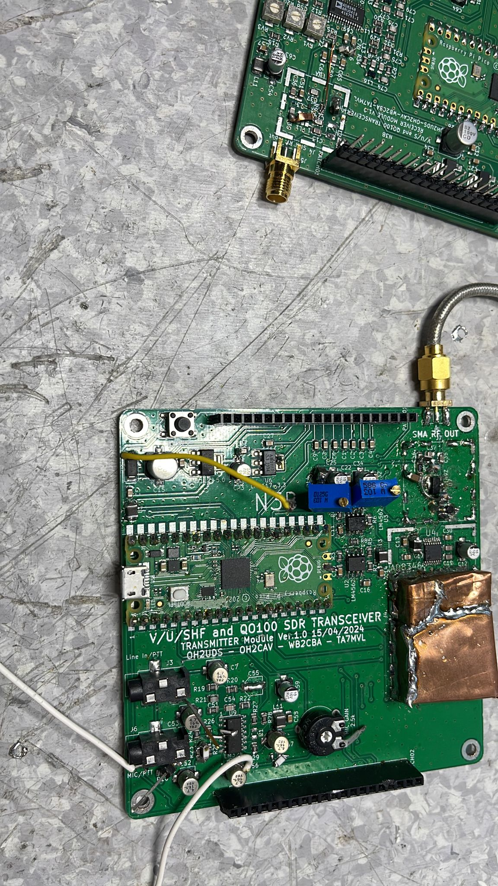

This file will contain the project history giving credits to all who have put a lot of effort for implementing dip sir architecture on small mcus and made this project happen (Guido, Arjante, Klaus, etc.)

initial pictures of the working HW 

